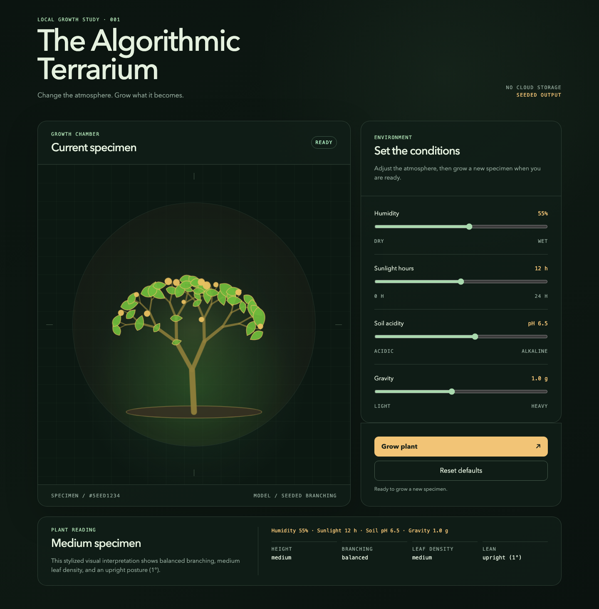
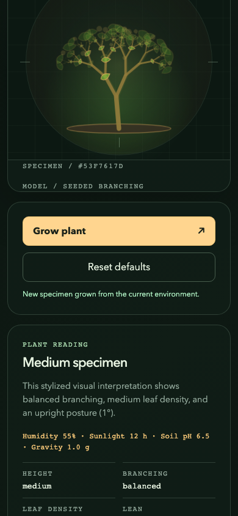

# The Algorithmic Terrarium

### Change the environment. Grow a different specimen.

A procedural plant experiment built with TypeScript and Canvas 2D. Adjust humidity, sunlight, soil acidity, and gravity, then watch a new branching form grow into the chamber. Each specimen gets a reading that connects its visible traits to the committed settings.

**[Controls](#four-environment-controls) · [Growth workflow](#grow-compare-repeat) · [How it works](#from-settings-to-specimen) · [Run locally](#run-locally)**



*The baseline specimen in the actual desktop interface. This is an artistic interpretation of environmental inputs, not a scientific model of plant biology.*

## Grow, compare, repeat

1. Start with the baseline plant and its default environment.
2. Move one or more sliders. Their displayed values change, while the existing specimen stays in place for comparison.
3. Press **Grow** to commit those settings and generate a new seeded form.
4. Watch the branches, leaves, and buds reveal themselves, then read the specimen's height, branching, leaf density, and lean.
5. Grow again to compare another variation. Up to three preceding specimens remain as faint ghost traces in the chamber.

| Action | What changes | What stays |
| --- | --- | --- |
| **Move a slider** | Draft settings and displayed input values. | Current specimen and its committed reading. |
| **Grow** | Advances the seed, commits the environment, and generates a new plant. | Recent specimens remain as ghost traces. |
| **Reset** | Restores the default environment and baseline specimen. | The session's ghost history is retained. |
| **Reload** | Returns to the baseline with an empty history. | Nothing from the previous session is persisted. |

## Four environment controls

| Control | Range | Default | What it influences in the artwork |
| --- | --- | --- | --- |
| **Humidity** | 0–100% | 55% | Branching depth and spread, leaf size, stem color, and leaf saturation. |
| **Sunlight hours** | 0–24 hours | 12 hours | Branch length and decay, bud probability, brightness, and accent hue. |
| **Soil acidity** | pH 3–9 | pH 6.5 | Leaf proportions and palette. |
| **Gravity** | 0.2–2.0 g | 1.0 g | Lean, bend, droop, and branch-length decay. |

Humidity and sunlight move in whole-number steps; pH and gravity use 0.1 steps. These mappings are deliberate visual rules. For example, gravity changes posture in this model rather than attempting a physically complete simulation.

### Read the result

The reading describes the plant that was actually generated, including its committed environment. It does not immediately reinterpret the old plant when you move a slider.

| Reading | Meaning |
| --- | --- |
| **Height** | A qualitative description of the generated form's height. |
| **Branching** | How sparse, balanced, or dense the branching appears. |
| **Leaf density** | The foliage character of that specimen. |
| **Lean** | Direction and angle derived toward the canopy's center. |
| **Specimen ID** | A visible hexadecimal seed label, beginning with `#5EED1234` for the baseline. |

The seed identifies the generated specimen, but there is no seed-entry control in the current interface. You cannot paste an ID to reload or share a plant through the app.

## A chamber that keeps a short memory



*A scrolled mobile detail during growth, not a screenshot of the entire phone page.*

Ghost traces make successive forms easier to compare without a separate gallery. The history is limited to three previous specimens and lives only in memory.

The mobile page places the chamber first, followed by Grow/Reset, the reading, and the controls. Grow does not automatically scroll the page. Reduced-motion users see the completed specimen immediately rather than the staged grow-in animation.

## From settings to specimen

| Stage | Implementation | Responsibility |
| --- | --- | --- |
| **Input** | Semantic HTML and native range controls | Captures the draft environment. |
| **State** | Vanilla TypeScript | Keeps draft settings separate from the committed plant and session history. |
| **Generation** | Seeded recursive geometry | Produces a bounded collection of branches, leaves, buds, and traits. |
| **Drawing** | Canvas 2D | Renders the plant and faint earlier specimens. |
| **Motion** | requestAnimationFrame | Reveals the prepared geometry over roughly 600 ms. |
| **Layout and resize** | CSS + ResizeObserver | CSS lays out the chamber and controls; ResizeObserver updates the canvas backing store. |
| **Build and checks** | Vite, TypeScript, Vitest, Playwright | Development/build tooling, unit tests, and browser tests. |

Generation happens outside the animation loop. The renderer reveals an already-generated form in stages, rather than rebuilding its geometry on every frame. Rapid Grow or Reset actions cancel the active reveal and start the new one.

The app uses a 640×640 drawing model and caps its canvas backing pixel ratio at two. The same environment, seed, and viewport produce deterministic geometry. Bounded recursion keeps a specimen within 127 branch segments and 128 leaf entries.

There are no runtime libraries listed in the package manifest. The interface and generation logic run client-side, without an account or application backend.

## Run locally

Use Node.js 22.12+ on the 22.x line, or Node.js 24+, with pnpm. The repository includes a pnpm lockfile.

```bash
git clone https://github.com/Arrangedgodly/terrarium.git
cd terrarium
pnpm install --frozen-lockfile
pnpm dev
```

Open the local address printed by Vite. No account, API key, or external data service is needed to generate a specimen.

| Command | Purpose |
| --- | --- |
| `pnpm dev` | Starts the development server. |
| `pnpm build` | Type-checks and builds the site into `dist/`. |
| `pnpm typecheck` | Runs TypeScript checks without emitting files. |
| `pnpm test` | Runs Vitest unit tests. |
| `pnpm test:watch` | Runs Vitest in watch mode. |
| `pnpm test:e2e` | Runs Playwright browser tests. |

For browser tests, install the configured Chromium runtime first:

```bash
pnpm exec playwright install chromium
pnpm test:e2e
```

The repository includes Cloudflare static-asset configuration for `dist/`. A deployment requires its own configured environment; running the local app does not publish it.

## Current scope

- A stylized generative-art experiment, rather than botanical or physical simulation.
- Session-only state and ghost history. No saved collection, account, collaboration, or cloud sync.
- No image export, shared links, editable seed input, or gallery in the current interface.
- Client-side operation does not imply an installed offline PWA.
- Tests describe specific generation/state/rendering behavior. They do not establish biological realism or universal browser accessibility compliance.

<details>
<summary><strong>Source guide</strong></summary>

| Area | File |
| --- | --- |
| Interface and control ranges | [`index.html`](index.html) |
| App wiring | [`src/main.ts`](src/main.ts) |
| Geometry and traits | [`src/generator.ts`](src/generator.ts) |
| Defaults, readings, and history | [`src/terrarium-state.ts`](src/terrarium-state.ts) |
| Canvas drawing and animation | [`src/plant-canvas.ts`](src/plant-canvas.ts) |
| Surface order | [`src/app-shell.ts`](src/app-shell.ts) |
| Styling | [`src/styles.css`](src/styles.css) |
| Product scope | [`PRODUCT.md`](PRODUCT.md) |

</details>
